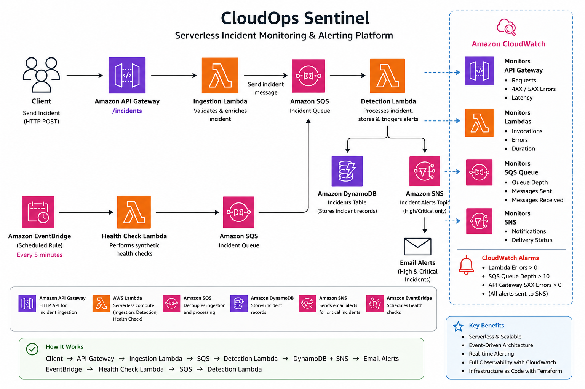
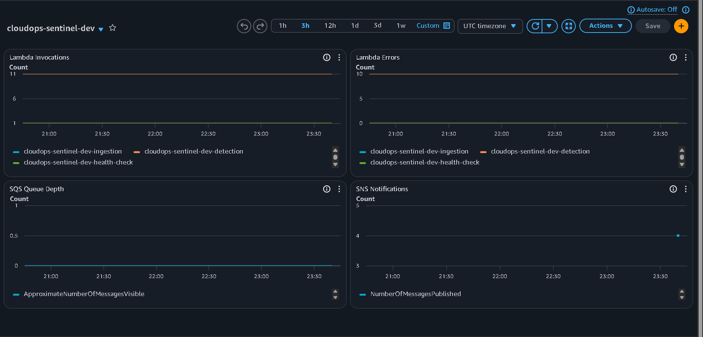
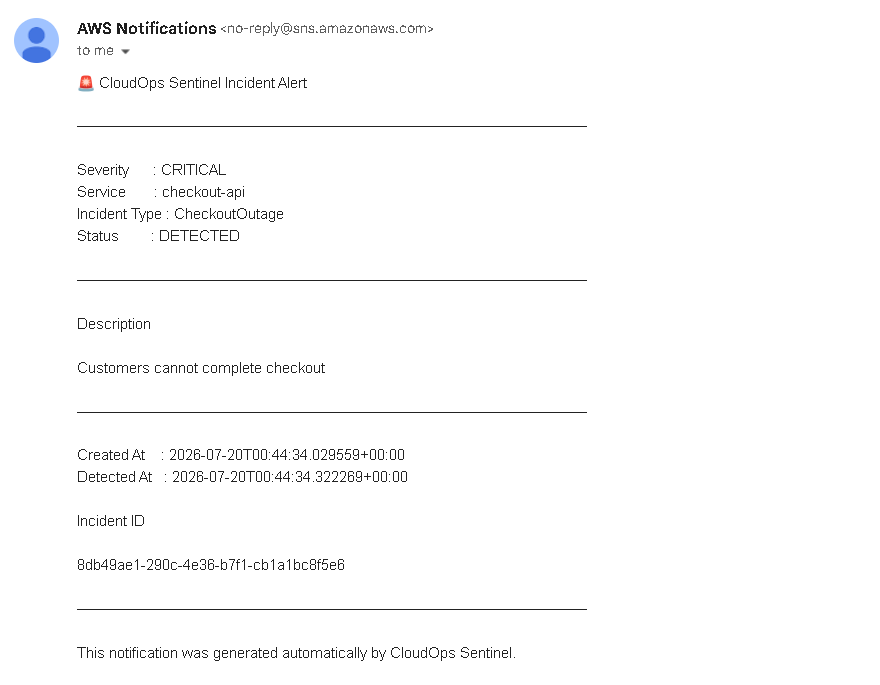

# CloudOps Sentinel

CloudOps Sentinel is a production-inspired serverless incident monitoring platform built on AWS using Terraform. It demonstrates how modern cloud applications ingest, process, monitor, and respond to operational incidents using fully managed AWS services.

---

# Architecture



---

# Features

- REST API built with Amazon API Gateway
- Serverless incident processing using AWS Lambda
- Asynchronous event-driven architecture using Amazon SQS
- Incident storage using Amazon DynamoDB
- Automatic email notifications using Amazon SNS
- Synthetic health checks using Amazon EventBridge
- CloudWatch dashboards for operational visibility
- CloudWatch alarms for automated alerting
- Infrastructure managed entirely with Terraform
- Least-privilege IAM permissions

---

# Skills Demonstrated

- Infrastructure as Code (Terraform)
- Serverless Architecture
- Event-Driven Systems
- Cloud Monitoring & Alerting
- Infrastructure Automation
- IAM Least-Privilege Design
- Asynchronous Messaging
- Cloud Operations

---

# AWS Services Used

- Amazon API Gateway
- AWS Lambda
- Amazon SQS
- Amazon DynamoDB
- Amazon SNS
- Amazon EventBridge
- Amazon CloudWatch
- AWS IAM
- Terraform

---

# Real-World Use Case

CloudOps Sentinel simulates an internal incident management platform used by cloud operations and Site Reliability Engineering (SRE) teams.

When a production service experiences an issue (such as high latency, payment failures, or an outage), another application submits an incident through the REST API.

CloudOps Sentinel automatically:

- Accepts the incident
- Queues it using Amazon SQS
- Processes it asynchronously
- Stores it in DynamoDB
- Sends email alerts for HIGH and CRITICAL incidents
- Monitors the platform using CloudWatch dashboards and alarms

---

# Architecture Flow

1. A production application reports an incident through Amazon API Gateway.
2. API Gateway invokes the Ingestion Lambda.
3. The Ingestion Lambda validates the request and publishes it to Amazon SQS.
4. The Detection Lambda consumes the queue.
5. The incident is stored in Amazon DynamoDB.
6. HIGH and CRITICAL incidents are published to Amazon SNS.
7. Amazon SNS sends an email notification.
8. Amazon EventBridge executes scheduled health checks every five minutes.
9. Amazon CloudWatch continuously monitors the health of the platform.

---

# Demo

The following workflow demonstrates the complete incident-processing pipeline.

1. Submit a critical incident through the REST API.
2. API Gateway immediately accepts the request.
3. The Ingestion Lambda places the incident into Amazon SQS.
4. The Detection Lambda processes the message.
5. Amazon DynamoDB stores the incident.
6. Amazon SNS sends an email alert.
7. Amazon CloudWatch records the activity and updates dashboards.

This simulates how an operations team automatically receives notifications when production services begin failing.

---

# Example Request (PowerShell)

```powershell
$body = @{
    service       = "checkout-api"
    incident_type = "CheckoutOutage"
    severity      = "CRITICAL"
    message       = "Customers cannot complete checkout"
} | ConvertTo-Json

Invoke-RestMethod `
    -Uri "https://<api-id>.execute-api.us-east-1.amazonaws.com/incidents" `
    -Method POST `
    -ContentType "application/json" `
    -Body $body
```

---

# Example Response

```json
{
    "message": "Incident accepted",
    "incident_id": "generated-incident-id",
    "sqs_message_id": "generated-message-id"
}
```

---

# Monitoring

CloudOps Sentinel continuously monitors:

- API Gateway requests and errors
- Lambda invocations
- Lambda errors
- Amazon SQS queue depth
- Amazon SNS notifications

CloudWatch alarms automatically notify operators when:

- Lambda Errors > 0
- API Gateway 5XX Errors > 0
- SQS Queue Depth > 10

---

## CloudWatch Dashboard



---

## SNS Incident Alert



---

# Project Structure

```text
cloudops-sentinel/
│
├── docs/
│   ├── architecture.png
│   ├── cloudwatch-dashboard.png
│   └── screenshots/
│       ├── sns-alert-email.png
│       └── dynamodb-record.png
│
├── infrastructure/
│   └── environments/
│       └── dev/
│
├── services/
│   ├── ingestion/
│   ├── detection/
│   ├── health_check/
│   ├── notification/
│   ├── remediation/
│   └── verification/
│
├── tests/
│
├── requirements.txt
│
└── README.md
```

---

# What I Learned

- Designing production-style serverless cloud architectures
- Building event-driven systems using Amazon SQS
- Deploying AWS infrastructure using Terraform
- Monitoring distributed systems with Amazon CloudWatch
- Implementing automated notifications using Amazon SNS
- Applying least-privilege IAM permissions
- Building scalable cloud-native applications using managed AWS services

---

# Future Improvements

- GitHub Actions CI/CD pipeline
- Dead Letter Queue (DLQ) support
- API authentication and authorization
- Terraform modules
- Multi-environment deployments
- Web dashboard for incident submission