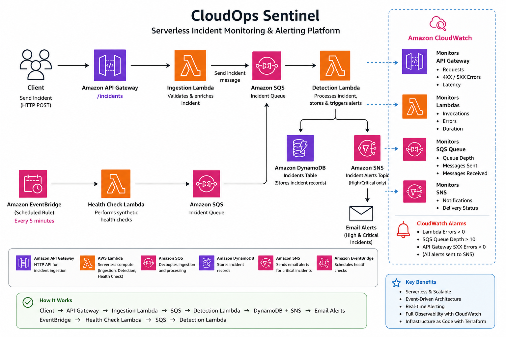
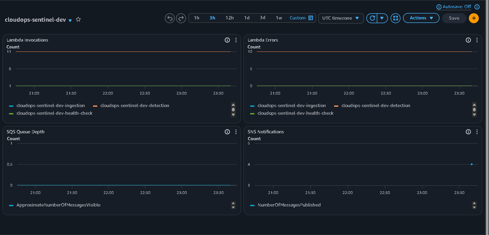
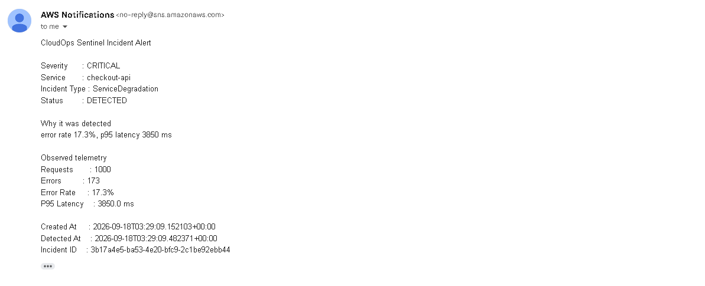

# CloudOps Sentinel

CloudOps Sentinel is a production-inspired serverless telemetry detection and incident monitoring platform built on AWS using Terraform. It demonstrates how modern cloud applications ingest, process, monitor, and respond to operational incidents using fully managed AWS services.

---

# Architecture



---

# Features

- REST API built with Amazon API Gateway
- Telemetry-based anomaly detection using AWS Lambda
- Rule-based severity classification from error rate and p95 latency
- Asynchronous event-driven architecture using Amazon SQS
- Incident storage using Amazon DynamoDB
- Automatic email notifications using Amazon SNS
- Synthetic health checks using Amazon EventBridge
- CloudWatch dashboards for operational visibility
- CloudWatch alarms for automated alerting
- Infrastructure managed entirely with Terraform
- Least-privilege IAM permissions

---

# Skills Demonstrated

- Infrastructure as Code (Terraform)
- Serverless Architecture
- Event-Driven Systems
- Cloud Monitoring & Alerting
- Infrastructure Automation
- IAM Least-Privilege Design
- Asynchronous Messaging
- Cloud Operations

---

# AWS Services Used

- Amazon API Gateway
- AWS Lambda
- Amazon SQS
- Amazon DynamoDB
- Amazon SNS
- Amazon EventBridge
- Amazon CloudWatch
- AWS IAM

---

# Real-World Use Case

CloudOps Sentinel simulates an internal incident management platform used by cloud operations and Site Reliability Engineering (SRE) teams.

Production services submit operational telemetry rather than pre-classified incidents. Each payload contains request volume, error count, and p95 latency.

CloudOps Sentinel automatically:

- Accepts and validates raw service telemetry
- Queues it using Amazon SQS
- Calculates error rate and evaluates latency asynchronously
- Classifies HEALTHY, MEDIUM, HIGH, or CRITICAL conditions
- Stores detected anomalies in DynamoDB
- Sends email alerts for HIGH and CRITICAL incidents
- Monitors the platform using CloudWatch dashboards and alarms

---

# Architecture Flow

1. A production application reports operational telemetry through Amazon API Gateway.
2. API Gateway invokes the Ingestion Lambda.
3. The Ingestion Lambda validates the measurements and publishes them to Amazon SQS.
4. The Detection Lambda consumes the queue and calculates error rate.
5. The detection engine evaluates error rate and p95 latency against explicit thresholds.
6. Healthy telemetry is logged without creating an incident.
7. Anomalies are classified MEDIUM, HIGH, or CRITICAL and stored in DynamoDB.
8. HIGH and CRITICAL incidents are published to Amazon SNS.
9. Amazon SNS sends an email notification to configured subscribers.
10. EventBridge sends synthetic healthy telemetry every five minutes to exercise the pipeline.
11. CloudWatch monitors the platform.

Detection thresholds in the current version:

| Severity | Error rate | P95 latency |
| --- | ---: | ---: |
| HEALTHY | < 5% | < 1000 ms |
| MEDIUM | >= 5% | >= 1000 ms |
| HIGH | >= 10% | >= 2000 ms |
| CRITICAL | >= 15% | >= 3000 ms |

The final severity is the higher severity produced by the error-rate and latency rules.

---

# Demo

For automatic measurement of actual application requests, see the
[application instrumentation guide](docs/application-instrumentation.md).
It includes a local HTTP application, WSGI middleware, periodic reporting, and
healthy/error/slow traffic scenarios. The PowerShell demo below remains useful
for submitting a fixed telemetry payload directly.

The demo submits degraded production telemetry. The caller does **not** specify an incident type or severity; CloudOps Sentinel derives both from the measurements.

```powershell
.\demo.ps1
```

Example telemetry:

```json
{
  "service": "checkout-api",
  "request_count": 1000,
  "error_count": 173,
  "latency_p95_ms": 3850
}
```

The detection engine calculates a 17.3% error rate. Under the current rules, both the error rate and latency independently reach the CRITICAL threshold, so an incident is persisted and an SNS alert is published.

## Example API Response

```json
{
  "message": "Telemetry accepted",
  "event_id": "generated-event-id",
  "sqs_message_id": "generated-message-id"
}
```

---

# Monitoring

CloudOps Sentinel continuously monitors:

- API Gateway requests and errors
- Lambda invocations
- Lambda errors
- Amazon SQS queue depth
- Amazon SNS notifications

CloudWatch alarms automatically notify operators when:

- Lambda Errors > 0
- API Gateway 5XX Errors > 0
- SQS Queue Depth > 10

---

## CloudWatch Dashboard



---

## SNS Incident Alert



---

# Project Structure

```text
cloudops-sentinel/
│
├── docs/
│   ├── architecture.png
│   ├── cloudwatch-dashboard.png
│   └── screenshots/
│       ├── sns-alert-email.png
│       └── dynamodb-record.png
│
├── infrastructure/
│   └── environments/
│       └── dev/
│
├── services/
│   ├── ingestion/
│   ├── detection/
│   ├── health_check/
│   ├── notification/
│   ├── remediation/
│   └── verification/
│
├── tests/
│
├── requirements.txt
│
└── README.md
```

---

# What I Learned

- Designing production-style serverless cloud architectures
- Building event-driven systems using Amazon SQS
- Designing transparent rule-based anomaly detection from service telemetry
- Deploying AWS infrastructure using Terraform
- Monitoring distributed systems with Amazon CloudWatch
- Implementing automated notifications using Amazon SNS
- Applying least-privilege IAM permissions
- Building scalable cloud-native applications using managed AWS services

---

# Future Improvements

- Per-service configurable thresholds
- Rolling-window and historical-baseline anomaly detection
- Automated remediation and post-remediation verification
- GitHub Actions CI/CD pipeline
- Dead Letter Queue (DLQ) support
- API authentication and authorization
- Terraform modules
- Multi-environment deployments
- Web dashboard for incident submission
